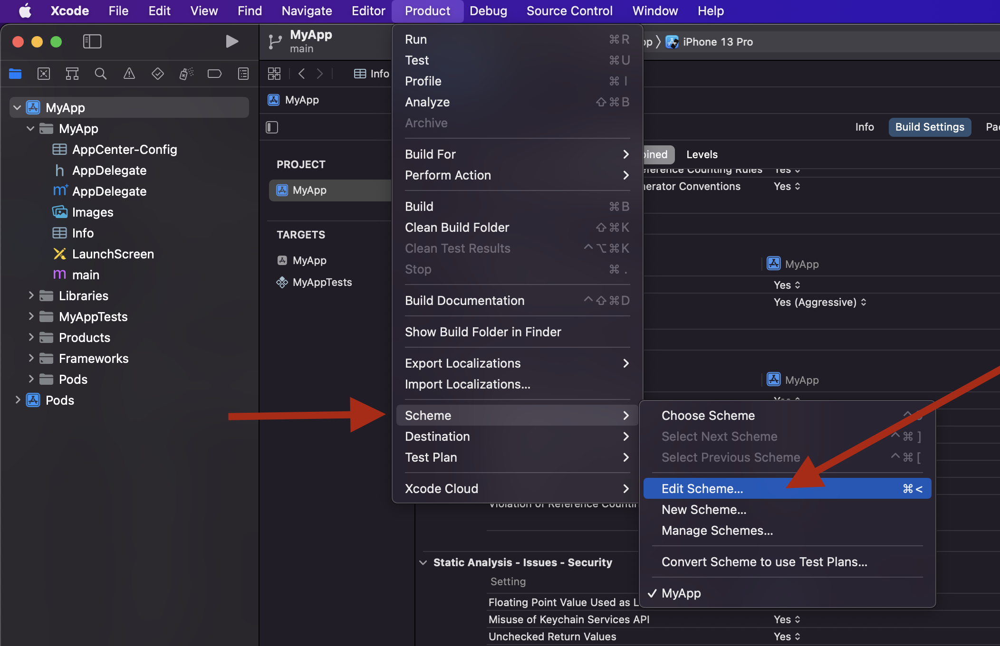
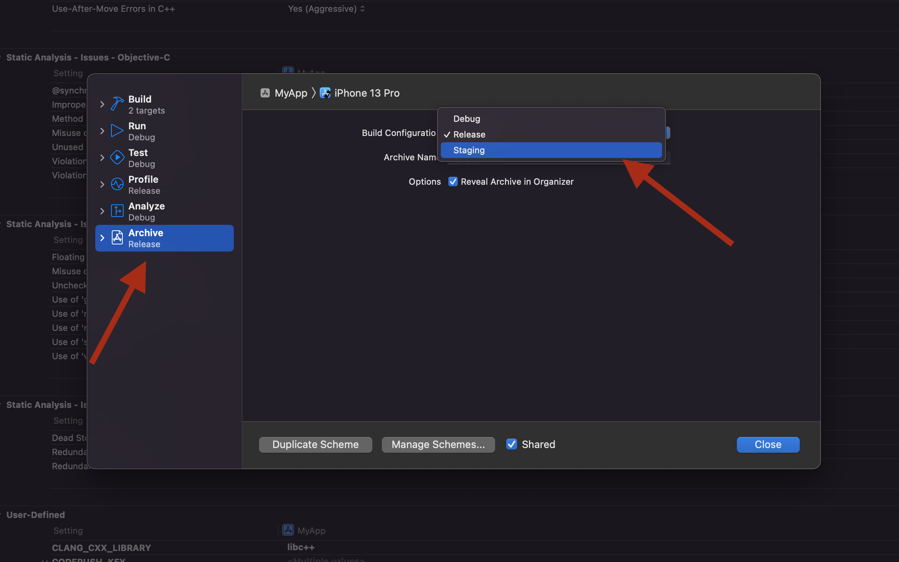
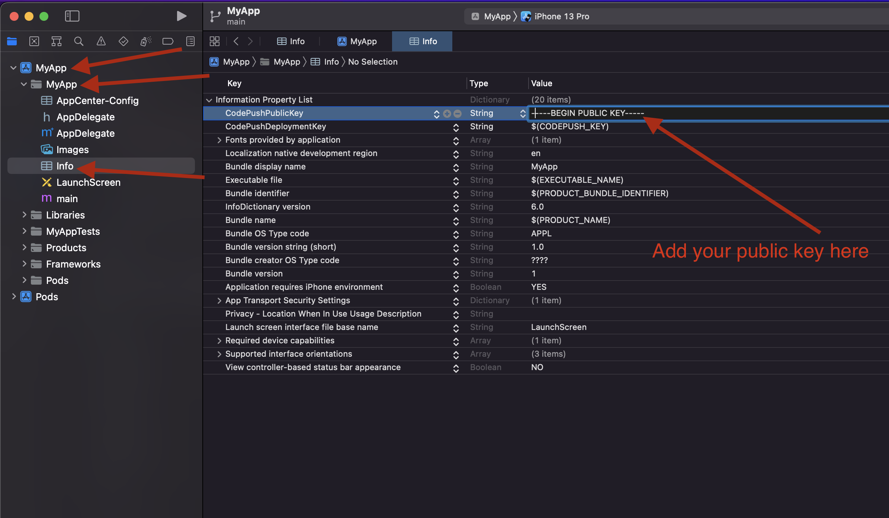
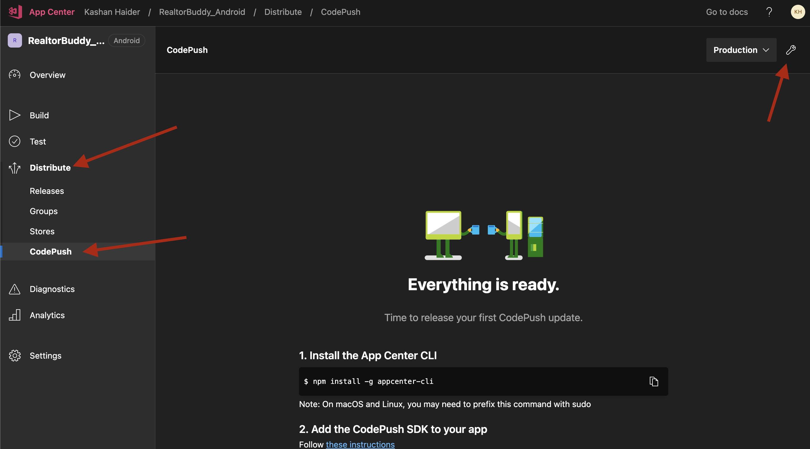

# STEPS TO FOLLOW

A React Native Template/Boilerplate containing the best practices and scalable design with cutting edge technologies like CodePush/Sentry and all other neccessary libraries pre-configured and basic helper functions and components to help you save your time and make your App super fast.

## INITIALIZE RN WITH THIS TEMPLATE

Command:<br/>

```
npx react-native init AppName --template https://github.com/SMKH-PRO/ReactNative_CodePush_Template.git
```

## 1. Install dependencies

**Note:** Dependencies will most probably be automatically installed when you initialize the project so you can skip this step.

Commands:<br/>

1. `yarn` or `npm i`<br/>
   and also install Pods:<br/>
1. `cd ios`
1. `pod install`

## 2. Prepare Husky

This project is pre-configured with husky, but you've to follow a few steps to enable it for you!
before going through the following steps, please make sure that the project is initialized inside a git repository.

1. Open `package.json` file
2. In the `scripts` object add new property `prepare` with value `husky install`.
   <br/>Your Scripts object will look something like this:

```
"scripts": {
    // other script ...
    "prepare":"husky install"
  }
```

3. Run the newly added script with command `yarn prepare` or `npm run prepare`

that's it, husky is now succesfully installed with a pre-commit that will check linting everytime you commit.

## 2. Setup Sentry

Commands:
npx @sentry/wizard -i reactNative -p ios android

modify the SENTRY URL from .env file (if .env does not exist, make one with "SENTRY" variable).

Your .env file will look like this:

```
SENTRY=https://a13f12a6c6274fd9a22a2759135e5ce5@o1305163.ingest.sentry.io/6629304

```

# 4. CodePush Setup

CodePush is pre-configured but you need to setup your keys, to do that follow the steps below:

**Install CLI** <br/>
`npm install -g appcenter-cli`

**Generate Private Key files for code signing:** <br/>
We will need these files later for code signing in Android & iOS
Commands:<br/><br/>
**For Private Key:**<br>
```
openssl genrsa -out codePushPrivateKey.pem
```

**For Public Key:**<br>
```
openssl rsa -pubout -in codePushPrivateKey.pem -out codePushPublicKey.pem
```

### CodePush iOS Setup

**Integrate the SDK in iOS**

Open `ios/AppName/AppCenter-Config.plist` file in XCODE or VS and replace `{Your app secret here}` with your actual app secret key.

The `AppCenter-Config.plist` file looks like this when you open with VS CODE:

```
<?xml version="1.0" encoding="UTF-8"?>
<!DOCTYPE plist PUBLIC "-//Apple//DTD PLIST 1.0//EN" "https://www.apple.com/DTDs/PropertyList-1.0.dtd">
<plist version="1.0">
    <dict>
    <key>AppSecret</key>
    <string>{Your app secret here}</string>
    </dict>
</plist>

```

<br/>

And will look like following on XCODE:<br/>


Double click on the `{Your app secret here}` and replace the value with actual app secret.

**Reminder:** You can get the app secret from codepush app's overview page.

### MutliDeployment Integration iOS

Custom build setting has already been configured in iOS but you need to add your deployment keys.

To set this up, follow these steps:

1. Open up your Xcode project and select your project in the Project navigator window

2. Ensure the project node is selected, as opposed to one of your targets

3. Select the Build Settings tab

4. In `Used-Defined` section, You'll see a setting named "CODEPUSH_KEY" open this setting and write your `staging` deployment key and `Release` deployment key.


And that's it! Now when you run or build your app, your staging builds will automatically be configured to sync with your Staging deployment, and your release builds will be configured to sync with your Production deployment.

### How to create staging release on iOS?<br/>

To create a staging build you can just edit scheme to `Staging`.<br/>

**Picture Guide**

Edit Scheme:


Scheme Selection:


That's it, Now after selecting `Staging` for `Archive build`, you'll get the staging App when you build archive release.

### Code Signing For iOS

In order to configure Public Key for bundle verification you need to edit record in Info.plist with name CodePushPublicKey and string value of public key content.<br/>
Replace the current public key with your own.<br>

Example:

```
<plist version="1.0">
  <dict>
    <!-- ...other configs... -->

    <key>CodePushPublicKey</key>
        <string>-----BEGIN PUBLIC KEY-----
MFwwDQYJKoZIhvcNAQEBBQADSwAwSAJBANkWYydPuyOumR/sn2agNBVDnzyRpM16NAUpYPGxNgjSEp0etkDNgzzdzyvyl+OsAGBYF3jCxYOXozum+uV5hQECAwEAAQ==
-----END PUBLIC KEY-----</string>

    <!-- ...other configs... -->
  </dict>
</plist>

```

**Picture Guide For Editing Public Key:**


### CodePush Android Setup

**Integrate the SDK in Android**<br>

Open file with the filename `appcenter-config.json` in `android/app/src/main/assets/` with the following content:

```
{
  "app_secret": "{Your app secret here}"
}
```

Replace `{Your app secret here}` with your actual app secret.

### MutliDeployment Integration Android

1. Open the project's app level `build.gradle` file (for example `android/app/build.gradle` in standard React Native projects)

2. Find the android `{ buildTypes {} }` section and edit `resValue` entries for both your `Staging` and `Release` build types, which reference your `Staging` and `Production` deployment keys respectively.

If you're in the correct gradle file, The buildTypes section will look like this:

```
android {
    ...
    buildTypes {
        debug {

          resValue "string", "CodePushDeploymentKey", ""
        }
        releaseStaging {

          resValue "string", "CodePushDeploymentKey", "<INSERT_STAGING_KEY>"
        }
        release {

          resValue "string", "CodePushDeploymentKey", "<INSERT_PRODUCTION_KEY>"
        }
    }
    ...
}
```

From this file replace `<INSERT_STAGING_KEY>` with your own Deployment key for `Staging`.<br/>

and Replace `<INSERT_PRODUCTION_KEY>` with your deployment key for `Production`.<br/>

That's it, No need to change anything else in this file.

### How to create staging release on Android?<br/>

To build an staging apk, the command for that will be 
```
cd android && ./gradlew assembleReleaseStaging
```
 and you'll find the output on `android/app/build/outputs/apk/releaseStaging`

### Code Signing For Android

Edit `CodePushPublicKey` string item in `/path_to_your_app/android/app/src/main/res/values/strings.xml` file, It may looks like this:

```
<resources>
   <string name="app_name">my_app</string>
   <string name="CodePushPublicKey">-----BEGIN PUBLIC KEY-----
MIIBIjANBgkqhkiG9w0BAQEFAAOCAQ8AMIIBCgKCAQEAtPSR9lkGzZ4FR0lxF+ZA
P6jJ8+Xi5L601BPN4QESoRVSrJM08roOCVrs4qoYqYJy3Of2cQWvNBEh8ti3FhHu
tiuLFpNdfzM4DjAw0Ti5hOTfTixqVBXTJPYpSjDh7K6tUvp9MV0l5q/Ps3se1vud
M1/X6g54lIX/QoEXTdMgR+SKXvlUIC13T7GkDHT6Z4RlwxkWkOmf2tGguRcEBL6j
ww7w/3g0kWILz7nNPtXyDhIB9WLH7MKSJWdVCZm+cAqabUfpCFo7sHiyHLnUxcVY
OTw3sz9ceaci7z2r8SZdsfjyjiDJrq69eWtvKVUpredy9HtyALtNuLjDITahdh8A
zwIDAQAB
-----END PUBLIC KEY-----</string>
</resources>
```

Replace the previous `PUBLIC KEY` with your own.
<br/>

### How to get CodePush deployment keys?<br/>

As a reminder, you can retrieve deployment keys by running command `appcenter codepush deployment list -a <ownerName>/<appName> -k` from your terminal <br/>

**OR**<br/>

Go to `CodePush` dashboard open the app and navigate to `distribute > codepush` now, on this screen click on `Create standard deployments` button, after clicking this button you'll see a setting icon at top right corner, click on it and you'll get deployment keys for both staging and production deployment/environments.



<br/>
<p style="text-align:center">--- END OF DOCS ---</p>
